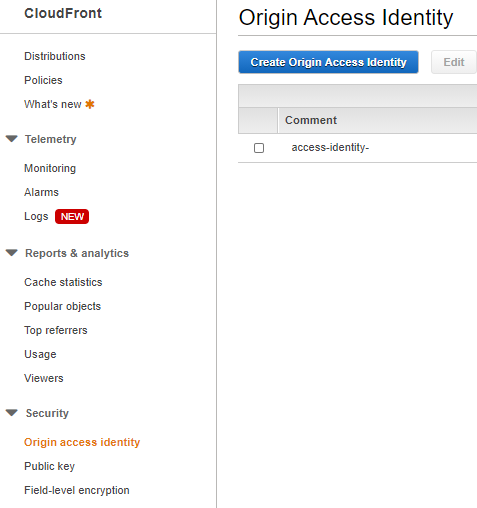
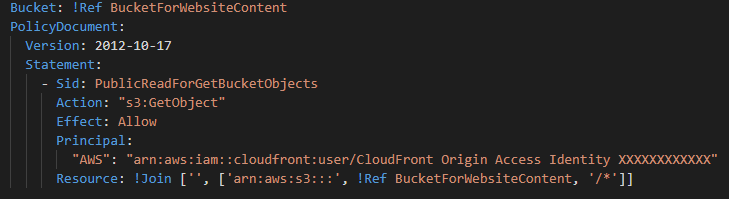
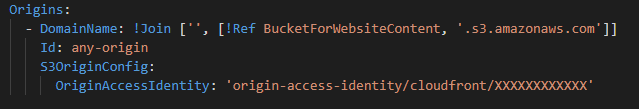

# A template for a secure static website leveraging s3, CloudFront and Route53, and restricting access to s3 bucket with OAI.

## The modifications you need to do:

- Find your Original Access Idendity.

- Change the XXXXXXXXXXXX in the bucket policy with your OAI.

- Change the XXXXXXXXXXXX in the CloudFormation origins configuration with your OAI.

