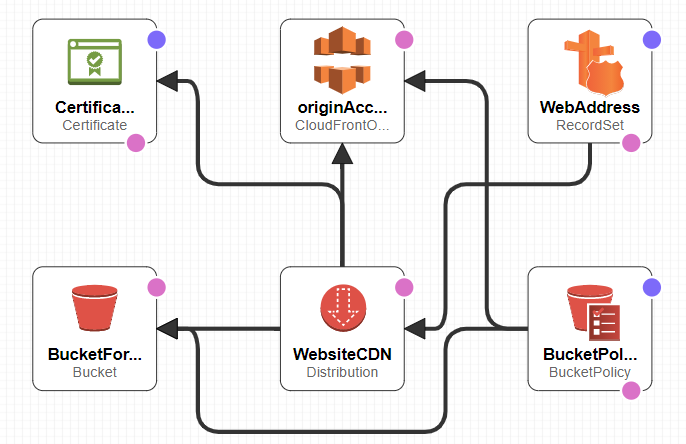

# A template for a secure static website leveraging s3, CloudFront and Route53, and restricting access to s3 bucket with OAI

# Prerequistes

- A Public Hosted Zone Route53

- Content for your website

# Steps

- Run the template

- Upload your content to the S3 Bucket after the template creates it

# Diagram of Services

